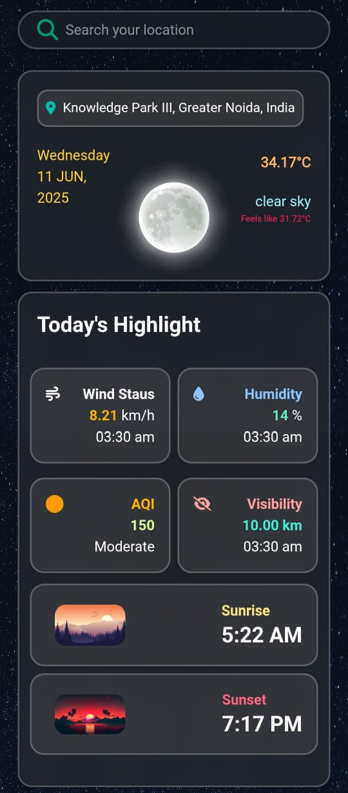

# 🌤️ Weather App

A sleek and responsive weather web application built using **React**, **HTML**, **CSS**, and **JavaScript**, leveraging the **OpenWeatherMap API**. This app provides real-time weather information and a 5-day forecast with 3-hour interval data.

---

## 🔧 Features

- 🌍 **Search any location** and get current weather
- 🌡️ **Real-time temperature, humidity, wind speed**, and more
- 📆 **5-day weather forecast** in 3-hour intervals
- 🌅 **Sunrise and Sunset times**
- 🌫️ **Visibility and Air Quality Index (AQI)**
- 🌙 **Clear UI for both day and night**

---

## 🛠️ Tech Stack

- **Frontend**: `React`, `HTML`, `CSS`, `JavaScript`
- **API**: [OpenWeatherMap](https://openweathermap.org/api)
